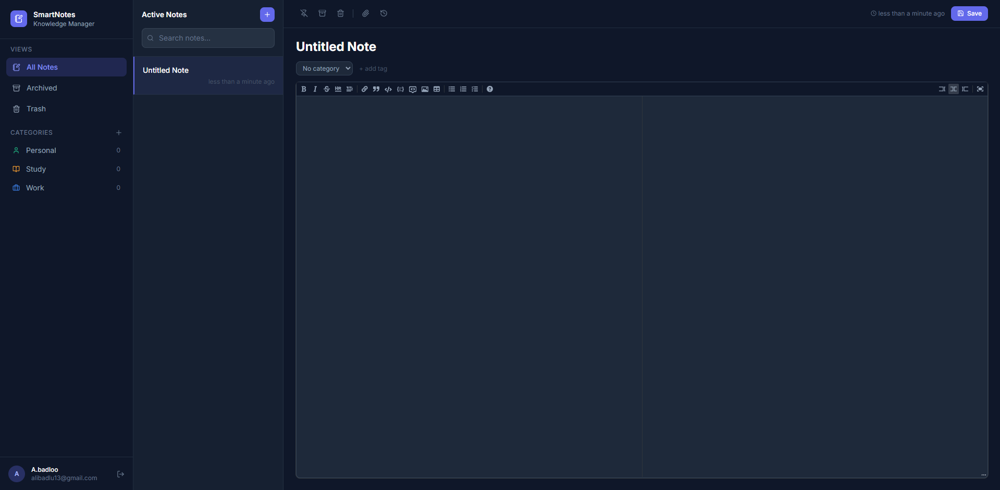
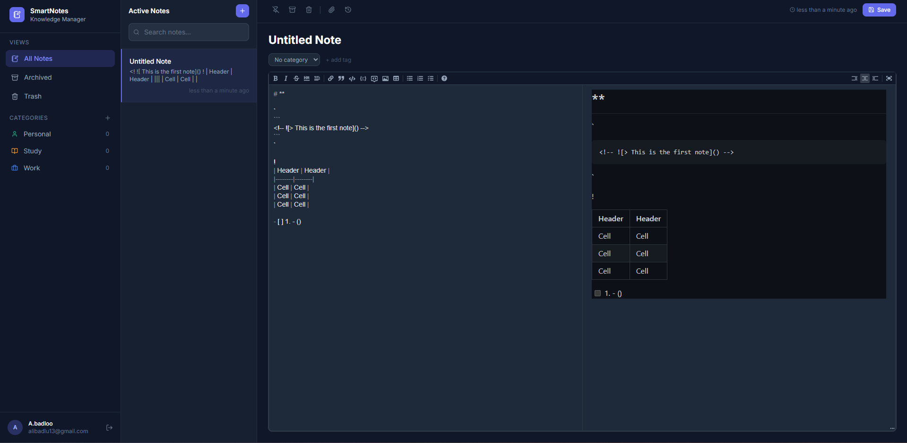

# SmartNotes — Knowledge Management System

A professional full-stack note-taking application inspired by Notion, Evernote, and Microsoft OneNote. Built with **C# .NET 8** on the backend and **React + TypeScript** on the frontend.

---

## Screenshots

### Login Page


### Main Dashboard


### Markdown Editor


---

## Features

| Feature | Description |
|---|---|
| **JWT Authentication** | Secure register & login with bcrypt password hashing |
| **Note Management** | Create, edit, delete, pin, and archive notes |
| **Markdown Editor** | Live split-pane markdown editing with full preview |
| **Auto Save** | Notes are saved automatically as you type (1.5s debounce) |
| **Version History** | Every save creates a new version — restore any point in time |
| **Categories** | Built-in Work / Personal / Study + unlimited custom categories |
| **Tags** | Add inline tags to notes for quick filtering |
| **File Attachments** | Upload and download files directly inside a note |
| **Search** | Real-time search across note titles and content |
| **Archive & Trash** | Soft-delete flow: Archive → Trash → permanent delete |

---

## Tech Stack

### Backend
| | Technology |
|---|---|
| Runtime | .NET 8 |
| Framework | ASP.NET Core Web API |
| ORM | Entity Framework Core 8 |
| Database | SQLite (dev) / SQL Server (prod) |
| Auth | JWT Bearer Tokens |
| Password | BCrypt.Net |

### Frontend
| | Technology |
|---|---|
| Framework | React 18 + TypeScript |
| Build | Vite 8 |
| State | Redux Toolkit |
| Styling | Tailwind CSS v3 |
| Editor | @uiw/react-md-editor |
| HTTP | Axios |
| Icons | Lucide React |

---

## Project Structure

```
SmartNotes/
├── backend/
│   └── SmartNotes.API/
│       ├── Controllers/       # Auth, Notes, Categories, Files
│       ├── Models/            # User, Note, Category, NoteVersion, NoteAttachment
│       ├── DTOs/              # Request/Response shapes
│       ├── Services/          # Business logic
│       ├── Interfaces/        # Service contracts
│       ├── Data/              # EF Core DbContext
│       ├── Middleware/        # Global exception handler
│       └── Program.cs         # DI, JWT, CORS configuration
│
└── frontend/
    └── smart-notes-app/
        └── src/
            ├── components/
            │   ├── auth/      # LoginForm, RegisterForm
            │   ├── layout/    # Sidebar
            │   └── notes/     # NoteList, NoteEditor
            ├── store/         # Redux slices (auth, notes, categories)
            ├── services/      # Axios API clients
            ├── hooks/         # useAutoSave, useAppDispatch
            └── types/         # TypeScript interfaces
```

---

## Getting Started

### Prerequisites
- [.NET 8 SDK](https://dotnet.microsoft.com/download/dotnet/8.0)
- [Node.js 18+](https://nodejs.org/)

### 1 — Clone the repository

```bash
git clone https://github.com/Alibadloo/smart-notes.git
cd smart-notes
```

### 2 — Start the Backend

```bash
cd backend/SmartNotes.API
dotnet run
# API running at http://localhost:5000
```

The SQLite database is created automatically on first run. No migrations needed.

### 3 — Start the Frontend

```bash
cd frontend/smart-notes-app
npm install
npm run dev
# App running at http://localhost:5173
```

Open [http://localhost:5173](http://localhost:5173) and create your account.

---

## API Endpoints

| Method | Endpoint | Description |
|---|---|---|
| `POST` | `/api/auth/register` | Create account |
| `POST` | `/api/auth/login` | Sign in, get JWT |
| `GET` | `/api/notes` | List notes (supports `?search=` `?categoryId=` `?status=`) |
| `POST` | `/api/notes` | Create note |
| `PUT` | `/api/notes/{id}` | Update note |
| `DELETE` | `/api/notes/{id}` | Soft-delete note |
| `POST` | `/api/notes/{id}/archive` | Toggle archive |
| `GET` | `/api/notes/{id}/versions` | Version history |
| `POST` | `/api/notes/{id}/attachments` | Upload file |
| `GET` | `/api/categories` | List categories |
| `POST` | `/api/categories` | Create category |

---

## Architecture Highlights

- **MVCS pattern** — Controllers delegate all logic to injectable Services via Interfaces
- **Auto-seeded categories** — Work, Personal, Study are created for every new user
- **Overlay animation pattern** — Pure Tailwind transitions with no JS animation library
- **Proxy in dev** — Vite proxies `/api/*` to `localhost:5000`, so no CORS issues during development
- **Single binary DB** — SQLite `.db` file sits next to the binary; swap one config line for SQL Server in production

---

## Contributing

This project was built as a portfolio piece covering full-stack concepts:
Authentication · Database Design · File Upload · REST API · Search · State Management

---

*Built with C# / .NET 8 / React / TypeScript*
